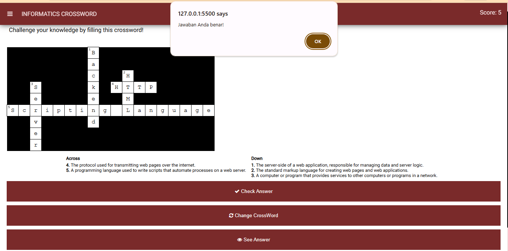
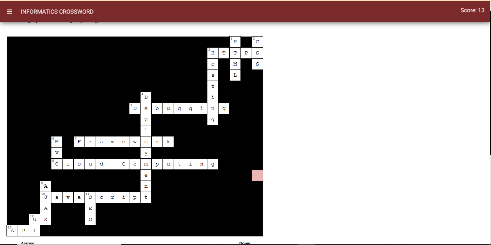
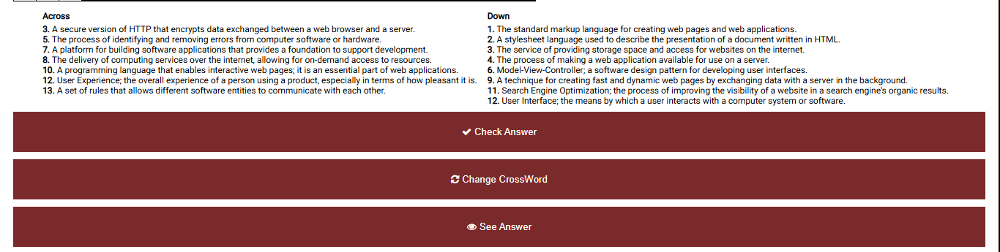
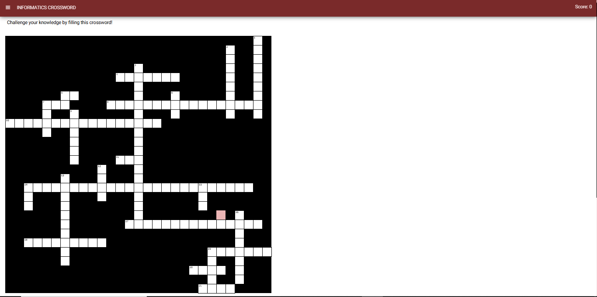
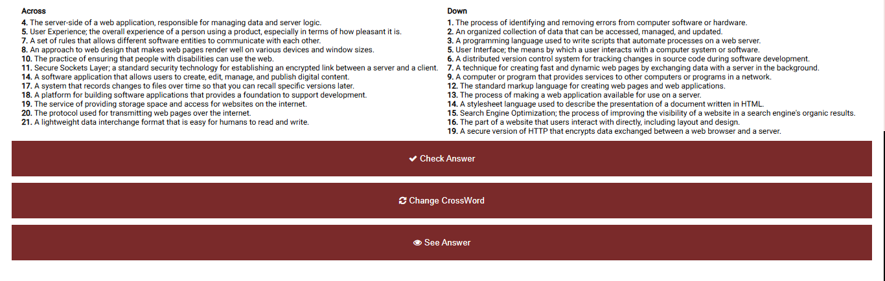

**Ujian Tengah Semester - Pengembangan Aplikasi Web**

**Nabila Lailatanzila - 1227050100**
------------------------------------

**Informatics Crossword** adalah aplikasi permainan teka-teki silang yang khusus dirancang untuk mempelajari istilah-istilah dasar informatika dengan cara yang menyenangkan dan interaktif. Aplikasi ini dibuat menggunakan **HTML** untuk struktur halaman, **CSS** untuk tampilan visual, dan **JavaScript** untuk logika interaktif, seperti menampilkan petunjuk, validasi jawaban, dan pengaturan skor. Selain itu, font *Roboto* diimpor untuk memberikan tampilan teks yang modern, dan ikon dari **Font Awesome** mempercantik tombol. File JavaScript eksternal seperti **`crossword.js`** berisi fungsi-fungsi inti permainan, sementara **jQuery** membantu dalam penanganan peristiwa dan manipulasi DOM agar pengalaman pengguna lebih dinamis.

**How to play Informatics Crossword:**

**1. User memilih tingkat kesulitan (Difficulty Level):** Adapun tingkat kesulitan yang disediakan yaitu easy, medium, dan hard. Tingkat kesulitan dibedakan berdasarkan banyaknya teka-teki yang harus dipecahkan. Semakin sulit level yang dipilih, maka semakin banyak pula teka-teki nya.

**2. User mengisi teka-teki berdasarkan hint yang tersedia:** User dapat memilih secara acak nomor teka-teki yang akan diisi. Tidak ada aturan baku untuk mengisi secara berurutan. Sehingga user dapat mengisi nomor dari yang paling mudah terlebih dahulu.

**3. Melakukan pengecekan jawaban:** Setelah mengisi teka-teki, user dapat mengecek apakah jawabannya benar atau tidak. Jika benar, skor akan bertambah 1. Dan jika salah, skor akan tetap. 

**4. Optional: Show Answer** Jika user merasa bingung dengan teka-teki nya, maka pilihan terakhir adalah dengan menekan tombol show answer. Namun, opsi ini tidak dianjurkan karena dapat mengurangi esensi permainan. 

**Dokumentasi Hasil:**

 Easy Level 

 Medium Level 

 Hard Level 

